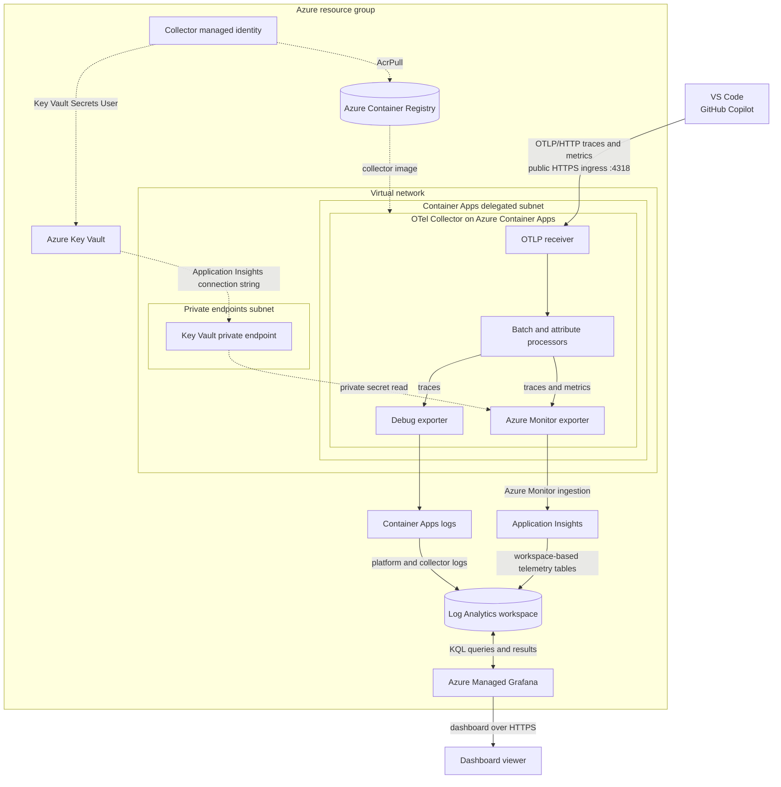

## Solution Dataflow Architecture

### Legend

* Solid arrows represent runtime telemetry, query, or user-interface data flow.
* Dashed arrows represent image, identity, or secret dependencies used to start and configure the collector.
* Subgraphs represent the Azure resource group, virtual network, delegated subnet, private endpoint subnet, and collector process boundaries.

### Key Relationships

* VS Code sends GitHub Copilot traces and metrics to the collector through public OTLP/HTTP ingress on port 4318.
* The collector batches telemetry, adds the `environment=prod` attribute, and exports it to Application Insights through the Azure Monitor exporter.
* Application Insights stores workspace-based telemetry in Log Analytics, where the Grafana Azure Monitor data source runs KQL queries.
* The trace debug exporter writes diagnostic output to Container Apps logs, which also flow to the Log Analytics workspace.
* The collector uses its managed identity to pull its image from Azure Container Registry and read the Application Insights connection string from Key Vault through a private endpoint.

### Scope Notes

* Terraform provisioning traffic and optional dashboard import are deployment-time flows and are outside this runtime dataflow view.
* The collector configuration also enables OTLP/gRPC on port 4317, but the deployed Container App ingress targets OTLP/HTTP on port 4318.
